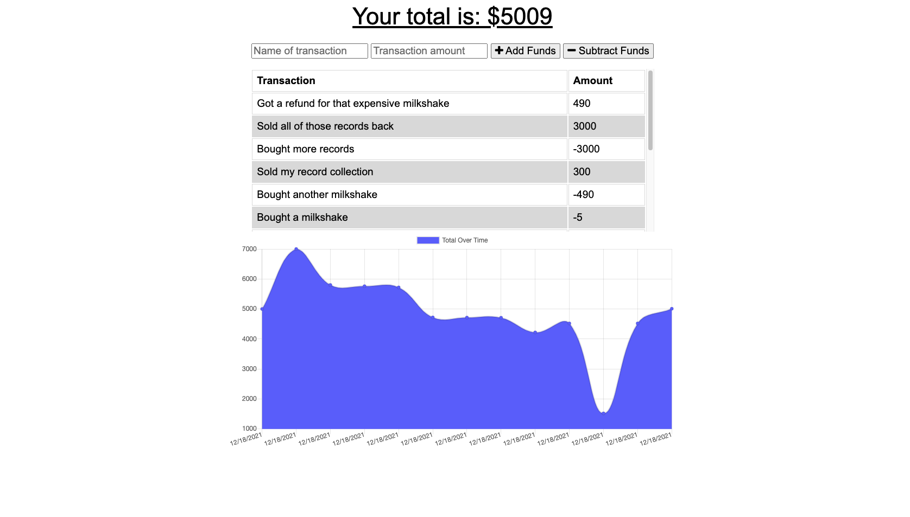

# ballin-on-budget

## Description
This is a budget tracker built using JavaScript, and some minimal CSS, with data storage using MongoDB and IndexedDB. My primary interest in developing this was learning more about offline access and functionality. Users can add and subtract budget items on this app while offline—when they return online, that data will persist and the total budget will repopulate.

[The app is deployed here on Heroku](https://aqueous-ravine-17872.herokuapp.com/)


## Table of Contents

- [Installation](#installation)
- [Usage](#usage)
- [Credits](#credits)

## Installation

The app is deployed via Heroku and requires no installation for use. To test offline functionality, open Dev Tools in your browser, go "offline" in the network tab, and create a transaction. Switch back to "no throttling," and you'll see that transaction remains.

If you'd like to run this locally, or tinker with the app yourself, download or clone the code off of this GitHub repo. Enter `npm install` from a CLI to install the dependencies and libraries you'll need, including Mongoose and Express.js. Entering `npm run start` will launch the app locally. Code away.

The bulk of the work done here came in writing the code to interact with the IndexedDB databse, like with this function used to save data while offline.

```
const saveRecord = (record) => {
  console.log("Save record invoked");

  const transaction = db.transaction(["BudgetStore"], "readwrite");

  const store = transaction.objectStore("BudgetStore");

  store.add(record);
};
```

## Usage

Enter the name of a transaction and a corresponding amount tied to that transaction, and choose to either add or subtract from your total funds. Budget responsibly.



Have a great day.


## Credits

The following links and documentation are just a sampling of the online resources that proved helpful as I was working on this. I also consulted with classmates in my coding bootcamp and with my tutor. 

- https://www.digitalocean.com/community/tutorials/js-intro-progressive-web-apps
- https://developer.mozilla.org/en-US/docs/Web/Manifest/background_color
- https://developer.mozilla.org/en-US/docs/Web/API/ServiceWorkerGlobalScope/skipWaiting
- https://developer.mozilla.org/en-US/docs/Web/JavaScript/Reference/Global_Objects/Promise/all
- https://stackoverflow.com/questions/36955441/indexeddb-creating-a-database-and-adding-content-failed-to-execute-transaction
- https://www.mongodb.com/developer/how-to/seed-database-with-fake-data/
- https://developer.mozilla.org/en-US/docs/Web/Manifest#example_manifest